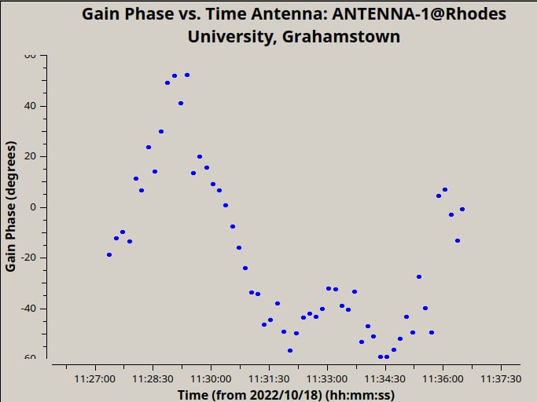

# Highlights of 2022

The TART project has had a lot to celebrate in 2022. What follows is a brief summary of events that took place.

## Team Expansion

We've had a good deal of expansion. The TART project has three teams

* Rhodes: Sonia, Ben, Rickus*, Stanley, Oleg, Patrice
* SARAO: Ben, Oleg, Ruby, Nadeem
* Stellenbosch: Rikus, Danie
* New Zealand: Tim, Phill, Max

Rickus (*) gets honourary membership of the Rhodes team for driving from Stellenbosch to Rhodes to help with the installation.

## TART-3 Updates

The NZ team has been hard at work on TART-3. Progress is now accelerating as the radio module is now in early testing.

TART-3 Radio Module             |  Features 
:-------------------------:|:-------------------------:
  | Two radios per module, PCI-e connector, Easy to replace modules

## Rhodes TART comissioning

Gained coverage in the media thanks to excellent organizing by the Rhodes team (Sonia, Rickus (hon), Stanley, Oleg, Patrice). This telescope was a 3-arm interferometer with a new design that allows easy reconfiguration.

The Rhodes student team             |  Dignitaries
:-------------------------:|:-------------------------:
  |  

## Establishing a new Github home

We began the process of moving the github repositories to a new home (https://github.com/tart-telescope). This also involves breaking up the huge monolithic TART repository in to smaller and more managable repositories.

## Documentation Updates

- New jupyter notebooks by Ruby ([tart notebooks](https://github.com/tart-telescope/notebooks)) these notebooks are going to be used in the inaugural TART workshop held at Rhodes.
- A new website based on Docosaurus  ([here](https://tart.elec.ac.nz/tart_website/))

## Measurement Set updates

Huge work by Ben Hugo on making the TART measurement set tools [tart2ms](https://github.com/tart-telescope/tart2ms). These have allowed some fantastic features:

* Rephasing of observations into a single measurement set.
* Incorporation of Catalogue in JSON into the measurement set.
* This allows potentially much more sensitive imaging!

## CASA calibration

Rhodes Calibration with CASA             |  Cal phase vs time
:-------------------------:|:-------------------------:
  |  

## TART workshops progress

Three TART workshops are now in various stages of preparation. 

* Jan 16-17: Breakthrough listen @ Rhodes (Stanley, Ben, Oleg)
* Mid 2023: Gabon (Patrice)
* Mid 2023: Ghana (Stanley)

## TART talks, mentions in media e.t.c

* Rhodes opening... (see above)
* Sonia: gave a talk to the RATT group
* Patrice: presented to African Astronomical Society (August?)
* Stanley & Tim: Talk in Kenya (8/12/22)
