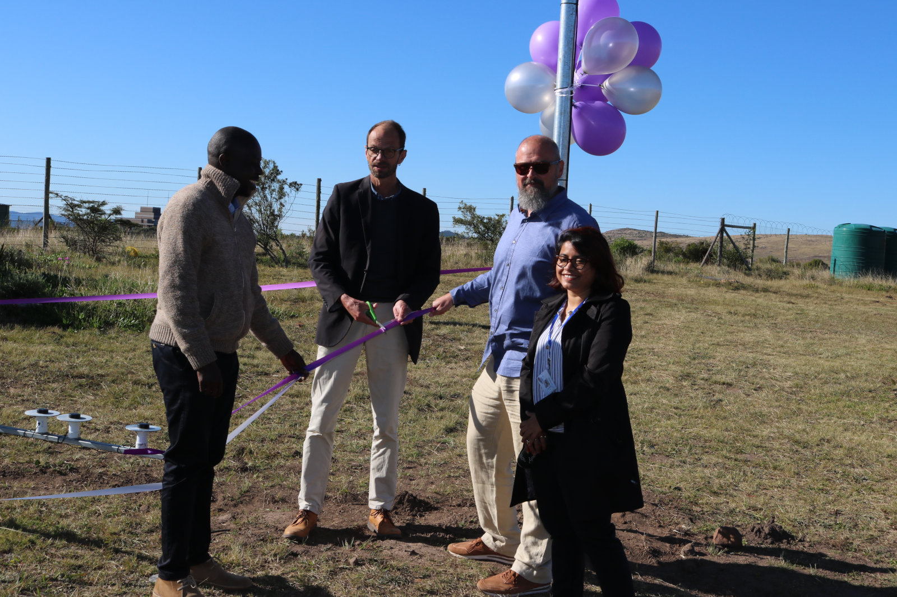

# Temps forts de 2022

Le projet TART a eu beaucoup à célébrer en 2022. Ce qui suit est un bref résumé des événements qui ont eu lieu.

## Élargissement de l'équipe

Nous avons eu beaucoup d'expansion. Le projet TART compte trois équipes

*Rhodes : Sonia, Rickus*, Stanley, Oleg, Patrice
* SARAO : Ben, Oleg, Ruby, Nadeem
* Stellenbosch : Rikus, Danie
* Nouvelle-Zélande : Tim, Phill, Max

Rickus (*) devient membre honoraire de l'équipe de Rhodes pour avoir conduit de Stellenbosch à Rhodes pour aider à l'installation.

## Mises à jour du TART-3

L'équipe néo-zélandaise a travaillé dur sur TART-3. Les progrès s'accélèrent maintenant car le module radio est maintenant en phase de test préliminaire.

Module radio TART-3 | Fonctionnalités
:-------------------------:|:--------------------- ---- :
 | Deux radios par module, connecteur PCI-e, modules faciles à remplacer

## Mise en service de Rhodes TART

Couverture médiatique grâce à l'excellente organisation de l'équipe de Rhodes (Sonia, Rickus (hon), Stanley, Oleg, Patrice). Ce télescope était un interféromètre à 3 bras avec une nouvelle conception qui permet une reconfiguration facile.

L'équipe étudiante de Rhodes | Dignitaires
:-------------------------:|:--------------------- ---- :
 | 

## Établir une nouvelle maison Github

Nous avons commencé le processus de déplacement des référentiels github vers une nouvelle maison (https://github.com/tart-telescope). Cela implique également de diviser l'énorme référentiel TART monolithique en référentiels plus petits et plus gérables.

## Mises à jour de la documentation

- Nouveaux cahiers jupyter de Ruby ([tart notebooks](https://github.com/tart-telescope/notebooks)) ces cahiers vont être utilisés dans l'atelier inaugural TART qui se tiendra à Rhodes.
- Un nouveau site web basé sur Docosaurus ([ici](https://tart.elec.ac.nz/tart_website/))

## Mises à jour des ensembles de mesures

Énorme travail de Ben Hugo sur la fabrication des outils de mesure TART [tart2ms](https://github.com/tart-telescope/tart2ms). Ceux-ci ont permis quelques fonctionnalités fantastiques :

* Rephasage des observations en un seul ensemble de mesures.
* Incorporation du catalogue en JSON dans l'ensemble de mesure.
* Cela permet une imagerie potentiellement beaucoup plus sensible !

## Étalonnage CASA

Étalonnage de Rhodes avec CASA | Phase cal vs temps
:-------------------------:|:--------------------- ---- :
 | 

## Avancement des ateliers TART

Trois ateliers TART sont maintenant à divers stades de préparation.

* 16-17 janvier : Écoutez Breakthrough @ Rhodes (Stanley, Ben, Oleg)
* Mi 2023 : Gabon (Patrice)
* Mi 2023 : Ghana (Stanley)

## TART parle, mentionne dans les médias, etc.

* Ouverture de Rhodes... (voir ci-dessus)
* Sonia : a donné une conférence au groupe RATT
* Patrice : présenté à l'African Astronomical Society (août ?)
* Stanley & Tim : Entretien au Kenya (8/12/22)
