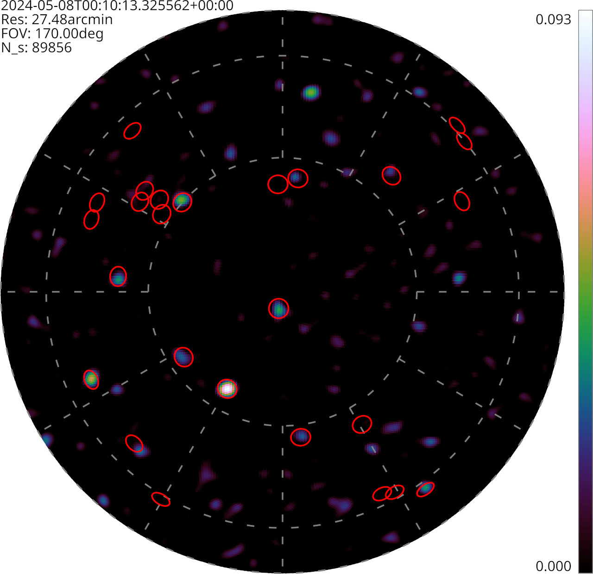

# Successful TART install in Mauritius

A successful TART installation [workshop](/docs/install/workshop) was held at Université des Mascareignes, on April 14-19 2024. This workshop was sponsored by SARAO, and the local organizing committee was led by Dr Keshav Sewraj. This was the first install of the new spiral antenna concept, and the first install of a TART telescope in an African partner nations. Three members of the TART team, Prof Oleg Smirnov (Rhodes University, South Africa), Dr Max Scheel (Electronics Research Foundation, New Zealand), Dr Nadeem Oozer (SARAO, South Africa), travelled to the workshop to help with the install.

"Taking lessons from the first TART "training the trainers" workshop organized by Dr Stanley Kuja at [Rhodes university in 2023](/blog/first-tart-workshop), the TART install at UdM went pretty smoothly. The team did an amazing job working around flooding in Dubai, as well as flooding in Mauritius, and the telescope was fully operational and making calibrated images on the last day of the workshop -- the did an epic job"

The new array layout is designed to be fabricated on site, with the antennas located on spiral arms at carefully chosen positions that maximize the imaging performance of the TART. 
|  |
| --- |
|  |
| TART volunteers Keshav Sewraj, Max Scheel, Oleg Smirnov, Nadeem Oozeer during assembly of the TART array at the workshop. Image Oleg Smirnov, licensed under [CC BY 4.0‍]( https://creativecommons.org/licenses/by/4.0/) |

As part of the workshop a day was devoted to public talks on the TART project (Tim Molteno, University of Otago), the TART telescope (Max Scheel) radio astronomy imaging (Prof Oleg Smirnov),and working with TART data by Dr Nadeem Oozeer. The workshop was attended by university students, advanced high-school students and members of the Mauritian research and education community.

|  |
| --- |
|  |
| University students, high-school students and members of the Mauritian community listening to public talks given by workshop presenters, licensed under [CC BY 4.0‍]( https://creativecommons.org/licenses/by/4.0/) |

## Photos

The fully assembled TART spiral antenna array is located on the roof of an Engineering Laboratory building on the Bel Air Campus of Université des Mascareignes.

## Images

We were delighted to find that the array was easily calibrated and now produces excellent images. Here is an image showing a bright unknown object at about 40 degrees elevation to the North.

This image was made using the instructions [here](/docs/basics/making-images).
