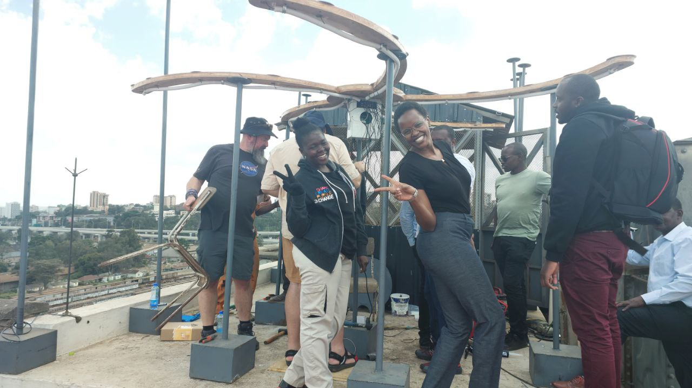
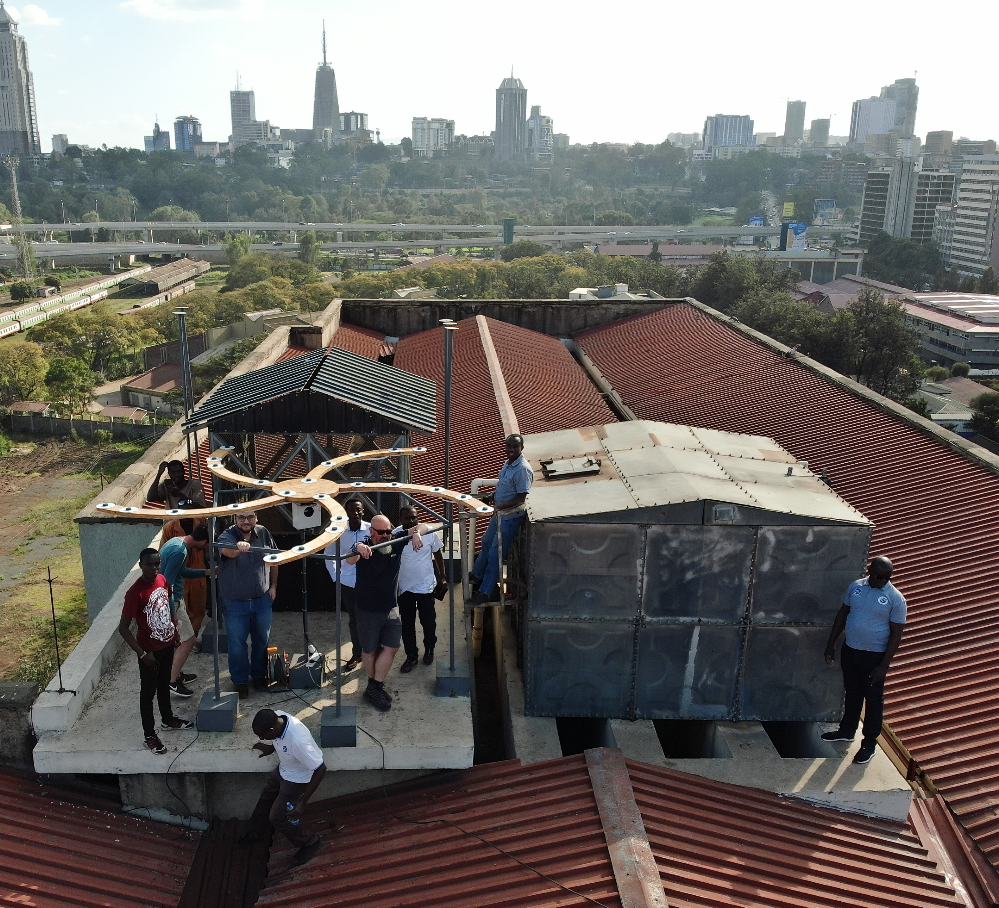
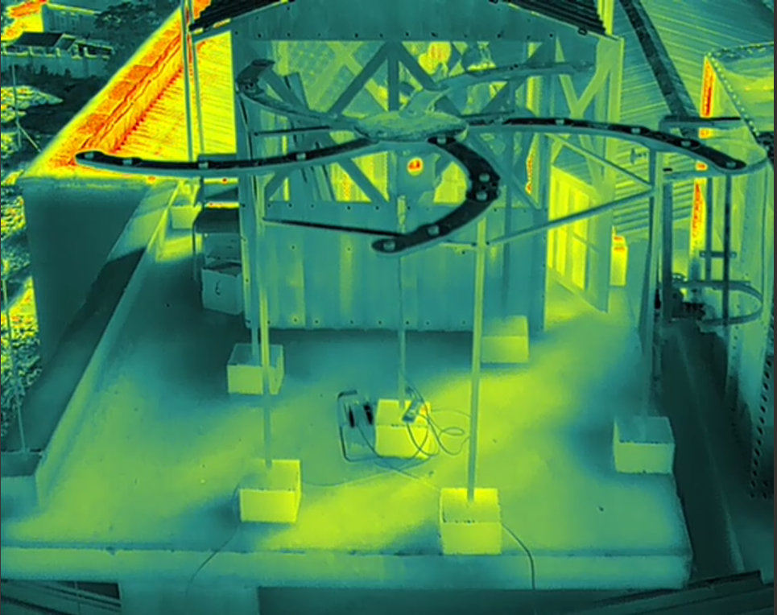
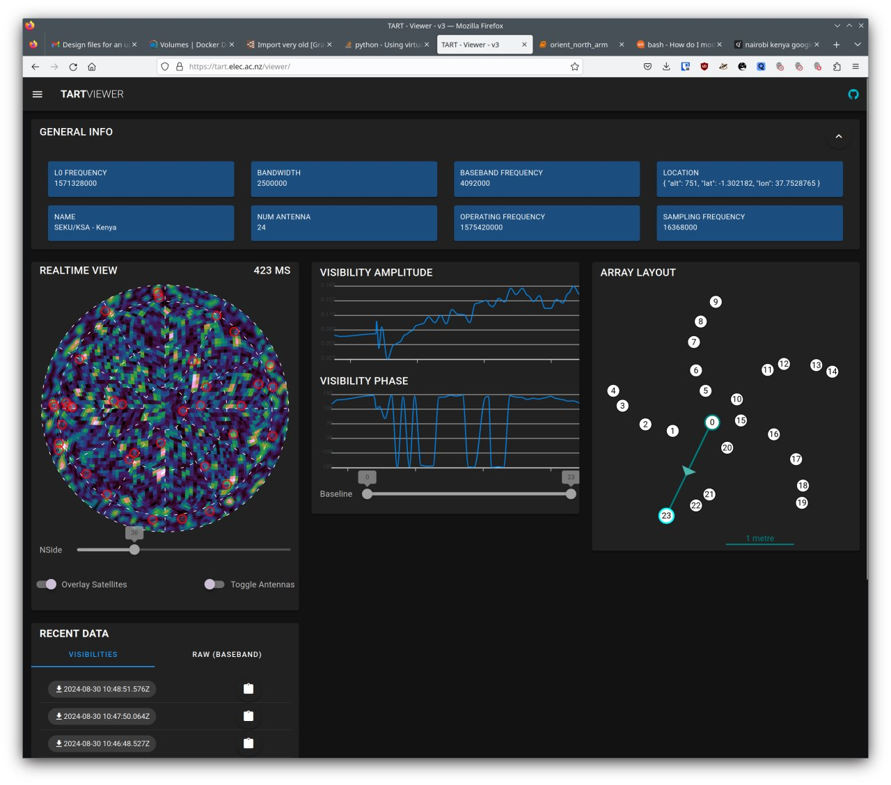

# Successful TART install in Kenya

A successful TART installation [workshop](/docs/install/workshop) was held at Technical University of Kenya, on August 26-30 2024. This workshop was sponsored by SARAO, and the local organizing committee was led by the Kenyan Space Agency, with the able assistance of Dr Willis Odobo. This was the first install of the new spiral antenna concept, and the first install of a TART telescope in an African partner nations. Three members of the TART team, Prof Oleg Smirnov (Rhodes University, South Africa), Mr Rikus Human (Electronics Research Foundation, New Zealand), Dr Ben Hugo (SARAO, South Africa), travelled to the workshop to help with the install.

"Taking lessons from the first TART "training the trainers" workshop organized by Dr Stanley Kuja at [Rhodes university in 2023](/blog/first-tart-workshop), as well as lessons from the [first TART install](/blog/tart-install-udm) during April in Mauritius, this workshop and install went smoothly. The team did an amazing job working around flooding in Dubai, as well as flooding in Mauritius, and the telescope was fully operational and making calibrated images on the last day of the workshop -- they did an epic job"

The new array layout is designed to be fabricated on site, with the antennas located on spiral arms at carefully chosen positions that maximize the imaging performance of the TART. 
|  |
| --- |
|  |
| TART volunteers during assembly of the TART array at the workshop. Image Calvince Juma, licensed under [CC BY 4.0‍]( https://creativecommons.org/licenses/by/4.0/) |

As part of the workshop a day was devoted to public talks on the TART project (Tim Molteno, University of Otago), radio astronomy imaging (Prof Oleg Smirnov), and working with TART data by Dr Nadeem Oozeer. The workshop was attended by university students, advanced high-school students and members of the Kenyan research and education community.

|  |
| --- |
|  |
| The TART kenya install on the roof of the Technical University of Kenya with the Nairobi skyline in the background. Image Mark, licensed under [CC BY 4.0‍]( https://creativecommons.org/licenses/by/4.0/) |

## Photos

The fully assembled TART spiral antenna array is located on the roof of an Engineering Laboratory building on the Nairobi campus of the Technical University of Kenya.

|  |
| --- |
|  |
| University students, high-school students and members of the Mauritian community listening to public talks given by workshop presenters, licensed under [CC BY 4.0‍]( https://creativecommons.org/licenses/by/4.0/) |

## Images

We were delighted to find that the array was easily calibrated and now produces images. Below is the first light image through the telescope console.

## Acknowledgements

The TART team would like to thank the [University of Otago](https://www.otago.ac.nz) and the [Electronics Research Foundation](https://www.elec.ac.nz) for providing the hardware, the South African Radio Astronomy Observatory ([SARAO](https://www.sarao.ac.za)) for supporting travel and staff time. We're also extremely grateful to the [DARA project](https://www.dara-project.org/) for supporting the accomodation in Kenya.
