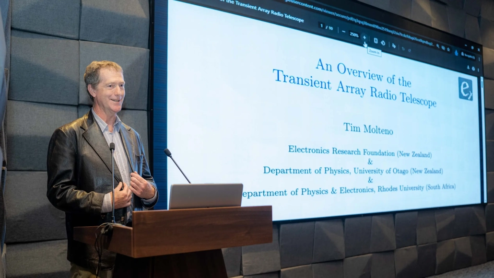

# TART on successfully deployed in Bangladesh

The Center for Astronomy, Space Science and Astrophysics (CASSA) of Independent University, Bangladesh (IUB) held a five-day workshop, titled “Installing a Radio Telescope to Image the Invisible”, to kick off the installation of a Transient Array Radio Telescope (TART), the first instrument of its kind in Bangladesh.

<!-- truncate -->

The workshop was held at the CASSA laboratory at IUB, where participants learned about the design and construction of the TART instrument. The workshop was attended by students from more than 10 local Universities, who were introduced to the TART project and its potential applications in astronomy and astrophysics. Students worked on calibration and imaging from the TART and 

The workshop was a huge success, and despite a large earthquake in Dhaka on the last day the workshop, the TART instrument was successfully deployed in Bangladesh. With the final student presentations held the next week on Friday 28 Nov.

|  |
| --- |
|  |
| Dr. Tim Molteno, Principal Instructor of the workshop, delivering the keynote address during the conference opening. Tim presented an overview of the Transient Array Radio Telescope (TART), its development, design philosophy, and scientific capabilities.  |

|  |
| --- |
|  |
| Dr. Khan Asad, Director of the Centre for Astronomy and Space Science and Astrophysics, and Shoaib Mirza of the IUB Fab Lab in front of the truss-tube IUB TART array support structure developed by the FAB Lab.  |

## Acknowledgements

The TART team would like to thank the [Independent University of Bangladesh](https://www.iub.ac.bd) and Dr Khan Asad the director of the [Centre for Astronomy and Space Science and Astrophysics](https://www.cassa.site/) for his amazing work in bringing students from more than 10 local Universities to this conference that introduced the TART project to Bangladesh.

## Links

* [Map of Worldwide TART installations](https://map.elec.ac.nz)
* [TART website](https://tart.elec.ac.nz)
* [TART GitHub](https://github.com/tart-telescope)
