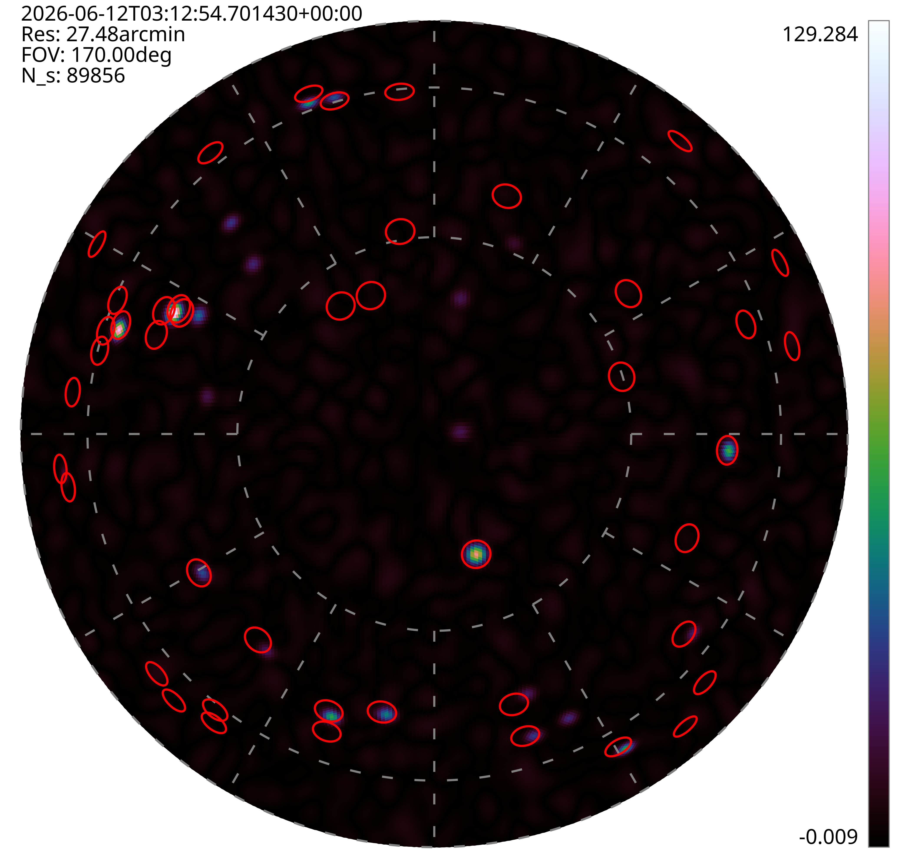
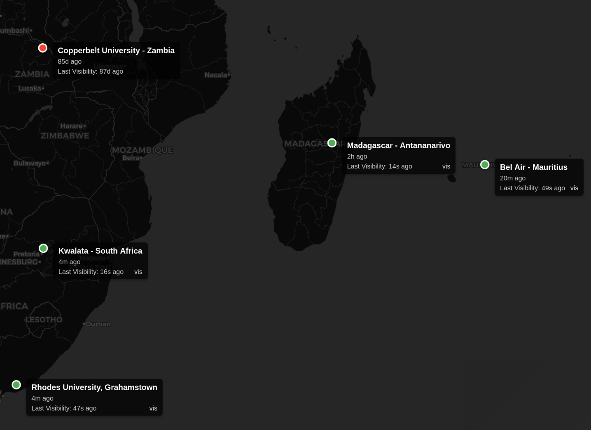
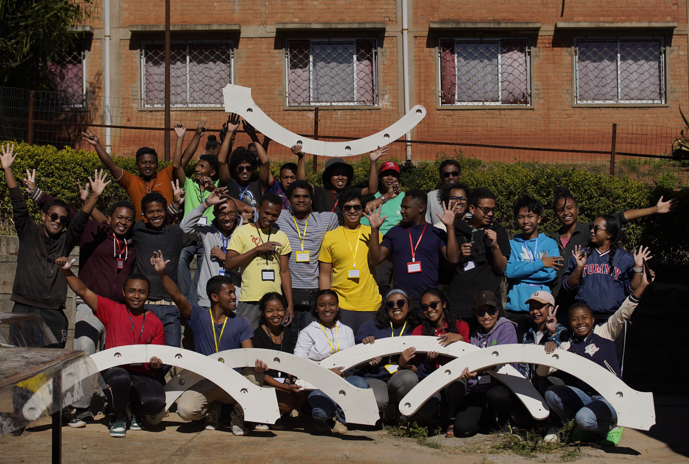

# TART successfully deployed in Madagascar

A TART installation [workshop](/docs/install/workshop) was held at Universite d'Antananarivo in Madagascar between June 8th and June 12th 2026. The Transient Array Radio Telescope (TART) is an open source radio telescope. Originally developed by Dr Tim Molteno, and students at the University of Otago's Department of Physics. The TART is a radio-telescope with the capability to observe the entire sky continuously and optimized to detect satellites, near-earth objects and transient events including high-energy cosmic rays. The telescope is also designed to serve as a platform for the development of new imaging algorithms.

As part of an effort to install TART telescope in all the African SKA Partner nations, this workshop followed installations in Namibia (2025), [Zambia](/blog/tart-install-zambia) (2025), [Botswana](/blog/tart-install-botswana) (2025), [Mauritius](/blog/tart-install-udm) and [Kenya](/blog/tart-install-kenya) (2024). The workshop was presented by Tim Molteno (University of Otago, New Zealand), Oleg Smirnov (Rhodes University, SARAO, South Africa), Landman Bester (SARAO), Max Scheel (Electronics Research Foundation, New Zealand) and Ben Hugo (SARAO, South Africa) with the support of the local installation team led by Prof Solohery Randriamapandry  at Universite d'Antananarivo.

The initiative to place TART telescopes in SKA African Partner nations was started in 2023 and is a joint effort of the [University of Otago](https://www.otago.ac.nz), [Rhodes University](https://www.ru.ac.za), the South African Radio Astronomy Observatory ([SARAO](https://www.sarao.ac.za)), the [DARA programme](https://www.dara-project.org/) and the [Electronics Research Foundation](https://www.elec.ac.nz).

<!-- truncate -->

|  |
| --- |
|  |
| First light image from the Madagascar TART, showing bright well-calibrated point sources in the radio sky. This image is created using the `spotless' point-source deconvolution algorithm. Image by Tim Molteno © 2026 licensed under [CC BY-SA 4.0](https://creativecommons.org/licenses/by-sa/4.0/) |

|  |
| --- |
|  |
| The TART world map now has a new entry. Madagascar! Image from the [Map of Worldwide TART installations](https://map.elec.ac.nz) |

|  |
| --- |
|  |
| Students with components of the TART telescope that they had built. Image Max Scheel © 2026 licensed under [CC BY-SA 4.0](https://creativecommons.org/licenses/by-sa/4.0/) |

|  |
| --- |
|  |
| Students proudly showing off the completed TART telescope. Image Max Scheel © 2026 licensed under [CC BY-SA 4.0](https://creativecommons.org/licenses/by-sa/4.0/) |

## Acknowledgements

Thanks to the amazing staff and students from Universite d'Antananarivo who organized the workshop, and to [EMSS](https://emssantennas.com) for donating the antenna array support hardware. The TART team would also like to thank the [University of Otago](https://www.otago.ac.nz) for support with staff time and hardware, [Rhodes University](https://ru.ac.za) for supporting travel and staff time. We're also extremely grateful to the [DARA project](https://www.dara-project.org/) for supporting the travel and accomodation for the New Zealand based TART team (Tim and Max), and to [SARAO](https://sarao.ac.za) for supporting staff time and travel.

## Links

* [Map of Worldwide TART installations](https://map.elec.ac.nz)
* [TART website](https://tart.elec.ac.nz)
* [TART GitHub](https://github.com/tart-telescope)
