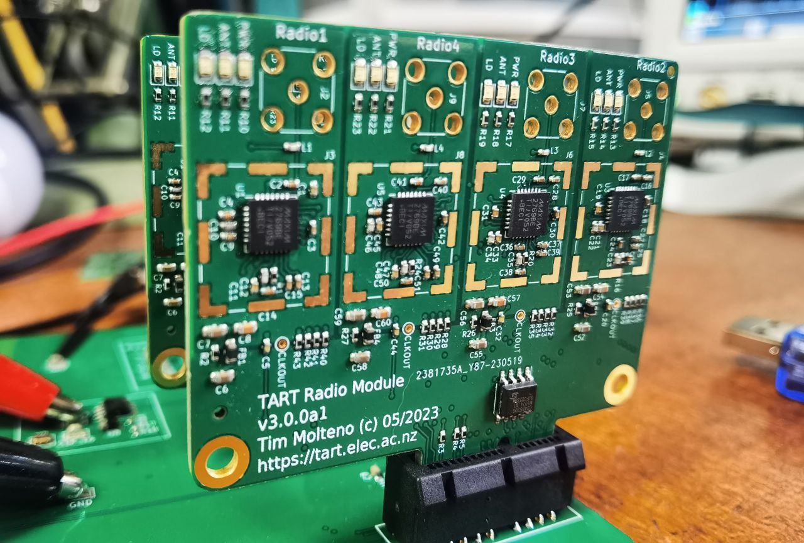
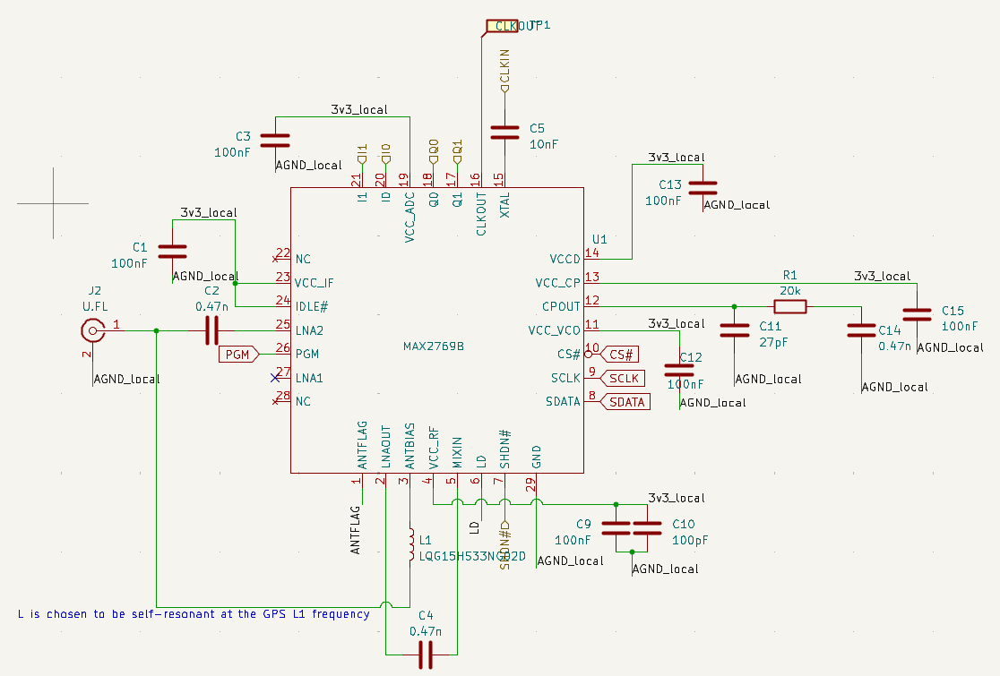
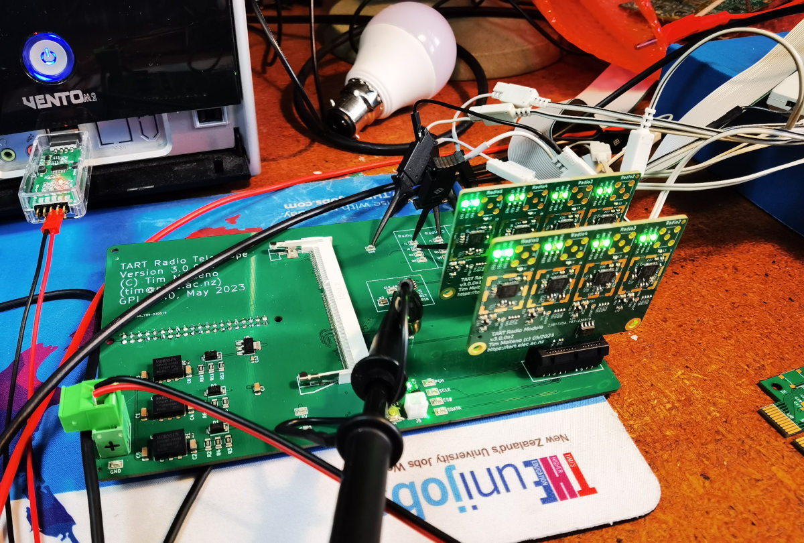
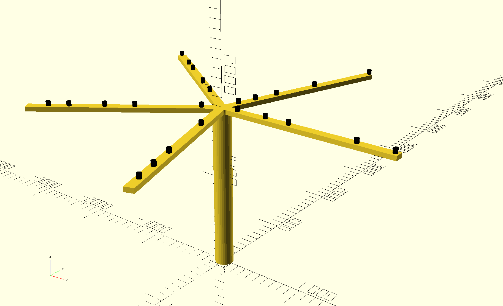
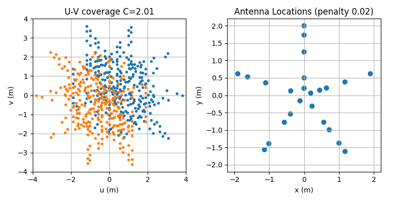

# Components of a TART telescope

The TART-3 telescope (the next version) will have a new hardware architecture.

## Electronics

Developed in the https://github.com/tart-telescope/radio_module repository. The hardware consists of a single motherboard, with radio modules mounted on replacable cards.

### Radio Module

These radio modules each contain four receivers, and are connected to active antennas using a SMA connector. The radio module is based around the [MAX2769 integrated GNSS receiver](https://www.analog.com/media/en/technical-documentation/data-sheets/max2769.pdf), the schematic is shown below. 

|  |
| --- |
|  |
| Schmatic of the TART radio front end. In the signal chain, there is also a low noise amplifier integrated into the antenna to overcome cable loss.  |

### Motherboard

The motherboard has 8 slots for radio modules. and houses:
* The FPGA correlator
* The linux computer that provides a web [API](/docs/basics/tart-api), connected to the internet, and runs the TART software.

Currently this is in development. Below is a photograph of the in development motherboard (May 2023 v3.0.0a1) with two radio boards.

## Antenna Array

This array is designed to be low cost. There is considerable freedom for TART sites to experiment with different array layouts.

Here is a rendering of a potential 5 arm layout, optimized to provide effective imaging. The individual antennas are the small black cylinders. Each arm is 2.1m long. The UV coverage of the proposed array is shown as well.

### Building your own array

There is a github repository (https://github.com/tart-telescope/array-structure) with DXF files for building the current antenna array design. The cam_files directory contains files to be CNC cut from sheets of marine grade experior plywood.

* [tart_array_4mm_sheet_1.dxf](https://github.com/tart-telescope/array-structure/blob/main/cam-files/tart_array_4mm_sheet_1.dxf). To be cut from a full sheet 2400x1200mm 4-6mm thickness plywood.
* [tart_array_4mm_sheet_2.dxf](https://github.com/tart-telescope/array-structure/blob/main/cam-files/tart_array_4mm_sheet_1.dxf). To be cut from a full sheet 2400x1200mm 4-6mm thickness plywood.
* [tart_array_9mm.dxf](https://github.com/tart-telescope/array-structure/blob/main/cam-files/tart_array_9mm.dxf). To be cut from a full sheet 2400x1200mm 9-12mm thickness plywood.

These three sheets can either be laser cut, or water-jet cut (these two options are unlikely to move during cutting). On each sheet is a 100mm x 100mm square (marked as such) that can be used as a reference for dimensions by the workshop doing the cutting.

The supports for the array-structure are often built from wooden poles. Alternatively a truss-tube structure has been developed by IUB which is truly wonderful.

## Changes in TART-3

TART-2 consisted of 4 radio hubs with 6 recievers on each hub. These connected via Cat-6 UTP cable to a central basestation.

The new hardware, TART-3 features

* Improved I/Q sampling - reducing a random phase offset on restart.
* Up to 2-bit I and Q samples can be digitized
* New Correlator FPGA - lower cost and higher performance.
* Easier to assemble Antenna Layout
* All radios are in a central location, lower costs.

## Costings

Costings are difficult to estimate as TART-3 is a new version of hardware and development is not complete. At the moment the hardware is being made available through the [TART workshop programme](/docs/install/workshop). The antenna array assembly is usually fabricated on-site from available materials.

Some extimates are below not including and freight charges:
* Electronics and antennas: Electronics can be made available to groups working on hardware and correlators on request from the New Zealand hardware team (see below for a potential other avenue).
* Case and Housing: Done on site: Allow ~EUR 100 (not including labour)
* Antenna array. Done on site, and costs will vary wideley as most of the costs are labour.  Can range for ~EUR 100 (using scrap and volunteer labour) to more (see below).

### Getting TART hardware

TART hardware [development kits](/docs/install/electronics) are available for purchase from the Electronics Research Foundation.
* Electronics including correlator, single board computer and antennas, will be ~EUR 3000 preassembled and tested.
* A flat-pack CNC machined antenna array mounting kit will also be made available. Check out the [TART discourse](https://discourse.tart.nz) for details.
