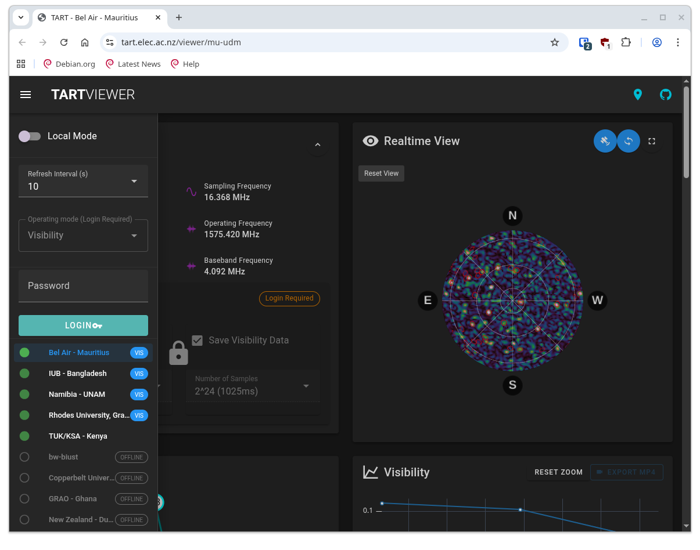

# Operating Modes

TART has many different operating modes. These are, visibility mode, raw-data mode, and diagnose mode. 

## Visibility Mode

This is the normal operating mode of a TART. In this mode the correlator will calculate visibility data. This data is stored on the [SBC](/docs/install/sbc) and is available through the [TART API](/docs/basics/tart-api).

## Raw-Data Mode

In this mode, the correlator will store raw data. This data is transferred to the [SBC](/docs/install/sbc) and is available through the [TART API](/docs/basics/tart-api). In this mode, visibility data is not calculated and imaging will not be possible through the web interface.

## Diagnose Mode

This is a debugging mode that helps locate problems with the TART. More details on using diagnose mode can be found in the [Diagnose Mode](/docs/install/debugging-antennas) section. Remember to change mode back to Visibility before logging out of the TART.


## Changing modes

To switch modes on a TART device, you will need the administrator password for your TART device. 


### Web Interface

To switch modes through the web interface, navigate to the tart web api, enter your password in the Mode panel and select the desired mode from the dropdown menu.

|  | 
| --- |
|  |
| The location of the password dialog in the web interface. To display this dialog click the three dashes at the top left of the screen. |

### Command Line

The [tart-tools](/docs/install/tart-tools) package provides a command line interface to change modes. To change modes, run the following command:


```
usage: tart_set_mode [-h] [--api API] [--pw PW] [--raw | --vis | --mode MODE]

Change telescope mode

options:
  -h, --help   show this help message and exit
  --api API    Telescope API server URL. (default: https://tart.elec.ac.nz/signal)
  --pw PW      API password (default: password)
  --raw        Set raw data mode. (default: False)
  --vis        Set vis mode (default: False)
  --mode MODE  New mode (vis/raw) (default: None)
```

To switch modes, run the following command:

```
tart_set_mode --api https://api.elec.ac.nz/tart/nz-elec --pw <password> --mode <mode>
```
