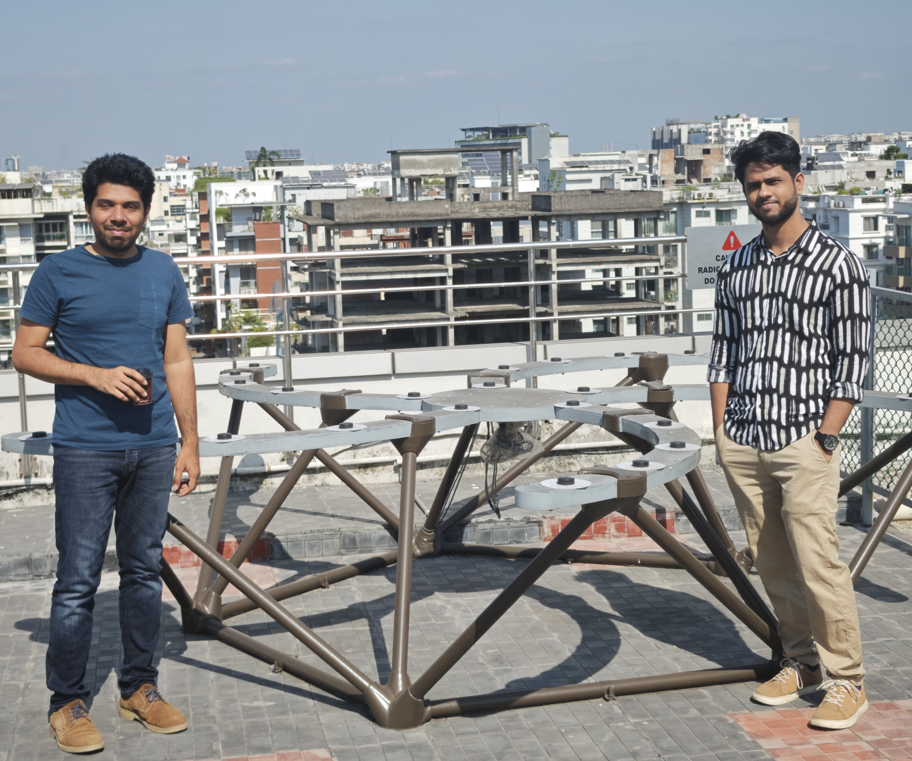

# Antenna Array

The TART antenna array structure has the job of holding the TART antennas in known locations. The spiral design is a key feature of the array, allowing for efficient packing and easy access to the antennas.

## Design Files

Design files for the TART antenna array are available in the [TART GitHub repository](https://github.com/tart-telescope/array-structure/). These files are in the form of FreeCad (.FCStd) files as well as dxf files that can be CNC or laser cut from sheets of plywood.

|  | 
| --- |
|  |
| Dr. Khan Asad, Director of the Centre for Astronomy and Space Science and Astrophysics, and Shoaib Mirza of the IUB Fab Lab in front of the truss-tube IUB TART array support structure developed by the FAB Lab.  |
