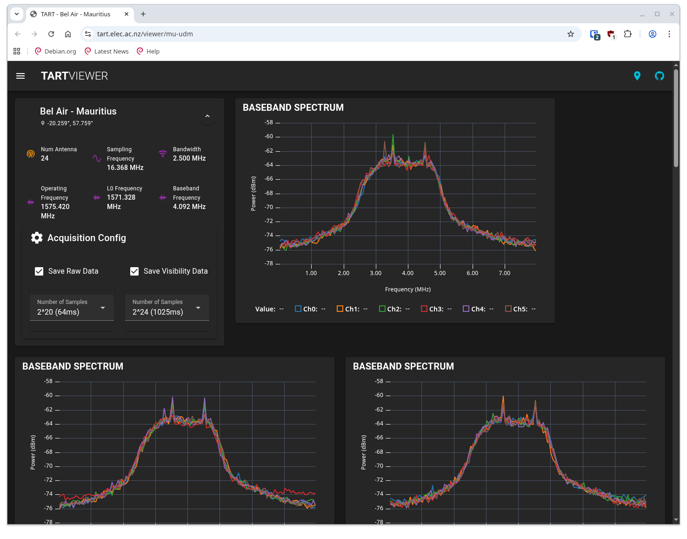

# Debugging Antennas

Here is a guide to finding faulty antennas and working out the root cause of the issue. This guide will help you identify the problem and provide solutions to fix it.

## Finding faulty antennas

Your first port of call is to check the telescope web app, specifically the gains and phases section. The calibration process will set the gain of a faulty antenna to zero. If you see a gain of zero for an antenna, it is likely faulty. Work through the following steps to check the specific antenna.

### Check the radio data

Put the telescope into [Diagnose Mode](/docs/basics/operating-modes.md#diagnose-mode). Remember to wait a while before the TART can calculate all the spectra.

|  | 
| --- |
|  |
| The Diagnose display showing spectra from each antenna.  |

Then check the spectrum for the antenna you suspect is faulty. If the signal is zero then the problem is likely (but not necessarily) to be the radio rather than the antenna. If the spectrum looks normal, then the problem is likely to be the antenna.

### Check the visibilities

Select a baseline that includes the antenna you suspect is faulty. If the antenna is faulty, and the radio is receiving zeros.  The visibilities should be zero for the faulty antenna. If the antenna is not connecting to the radio then the visibilities should be low amplitude (lower than other visibilities).
