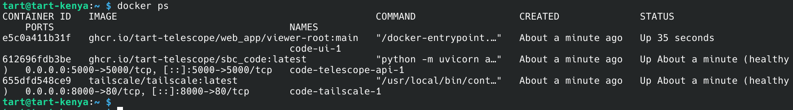

# Debugging Networking

Here is a guide to debugging network connectivity issues with a TART. If you can see your TART on the [TART Map](https://map.elec.ac.nz), then your TART is successfully connecting to the network. If you can not see your TART, or it is listed in red, then you may have a local network connectivity issue.

## Ethernet and WiFi

The TART uses either Ethernet, or WiFi connectivity. By default TART expects to use DHCP to configure the network interface. If networking is not working, then try the following tests:

### Test 1: WiFi Connection

Create a hotspot on your phone called "elec-research" with the password "ragamuffin". Then detach the Ethernet cable (if connected) and switch the TART off, wait for about 30 seconds, and turn the TART on again.

Then check the hotspot to see what devices are connected. The TART should connect to your hotspot.  If it does not, then there is a problem that requires external 

If the TART does not connect to the Wifi, then then go to the [connect external monitor](#check-sbc-bootup) section.

If the TART does connect to the WiFi hotspot, wait a few minutes and Check to see whether your TART appears in on the [TART Map](https://map.elec.ac.nz)
* If it does, then the cloud infrastructure is working as well and networking is good.
* If the TART does not appear on the map, then try [SSH connecting over Wifi](#ssh-into-sbc)

### SSH into SBC
should be able to make an [ssh connection](https://aoterodelaroza.github.io/coursenotes/remote_connection/) to the TART from a laptop connected to the same mobile hotspot. The default username is and password should be written on the TART box. If you can't find these, please [get in touch](/docs/basics/get-in-touch). 

Once connected, you should be able to see a terminal session. Type the following command once logged in: 
|  | 
| --- |
|  |
| The results of a succesful test of whether docker is running on the TART.  |

### Check SBC Bootup

The next stage will require an external monitor to connect to the RPi in your TART.
