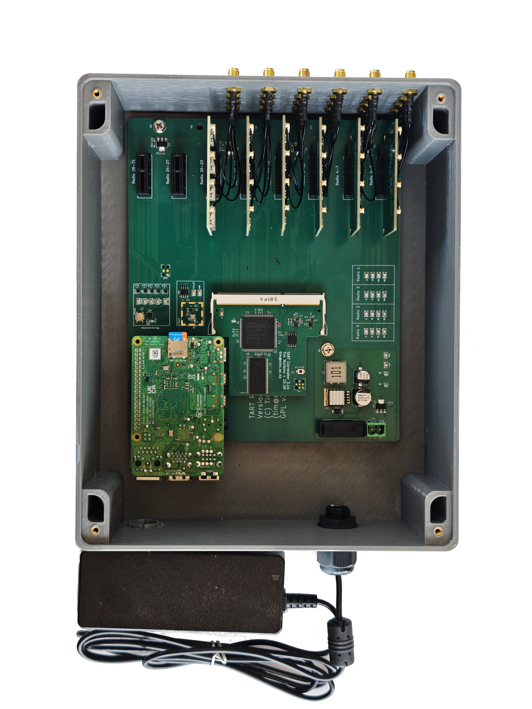

# Electronics

The TART Electronics consist of the motherboard, The 24 radio receivers on 6 radio modules, the correlator, the single-board-computer, the power-supply, associated co-ax cables and the enclosure.

Also required for a complete TART are the [array hardware](/docs/install/array)

|  | 
| --- |
|  |
| TART 2026 Development kit. This includes all the electronics required for a TART telescope.
