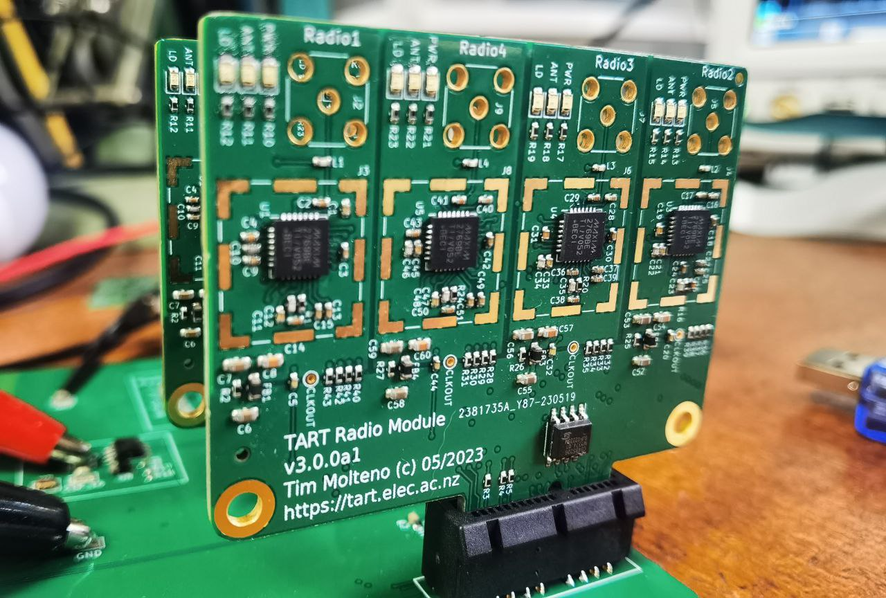
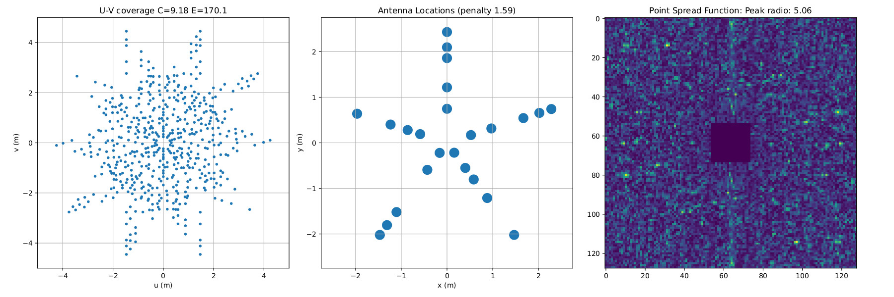

# Components of a TART telescope

The TART-3 telescope (the next version) will have a new hardware architecture.

## Electronics

Developed in the https://github.com/tart-telescope/radio_module repository. The hardware consists of a single motherboard, with radio modules mounted on replacable cards.

### Radio Module

These radio modules each contain four receivers.

### Motherboard

## Antenna Array

## Changes from TART-2

TART-2 consisted of 4 radio hubs with 6 recievers on each hub. These connected via Cat-6 UTP cable to a central basestation. TART-3 features

* Improved I/Q
